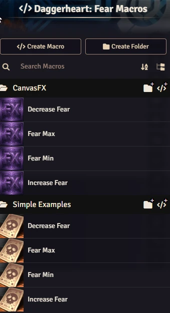
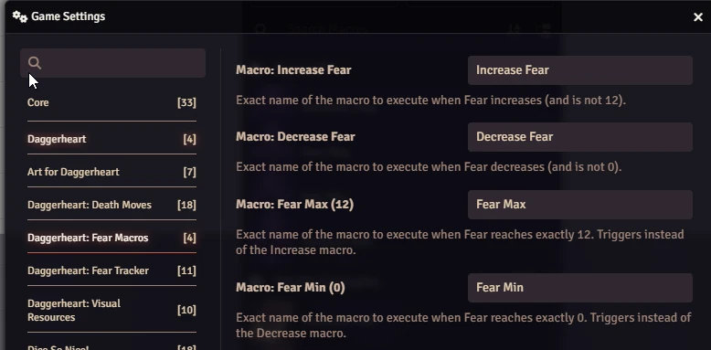

# Daggerheart: Fear Macros

A Foundry VTT module designed for the Daggerheart system. The primary goal of this module is to trigger specific macros whenever the Fear resource changes.

This allows Game Masters to automate events, send chat messages, or trigger visual effects (via macros) exactly when the Fear count goes up, down, hits zero, or reaches its maximum.

## Features

- **Automated Triggers:** Detects changes in the global Daggerheart Fear resource.
- **Configurable Macros:** Assign different macros for:
  - Fear Increase
  - Fear Decrease
  - Fear Max (12)
  - Fear Min (0)

## Manual Installation

To install this module manually, use the following manifest URL in the "Install Module" dialog within Foundry VTT:

`https://raw.githubusercontent.com/brunocalado/daggerheart-fear-macros/main/module.json`

## Getting Started

This module includes a **Compendium Pack** named **Daggerheart: Fear Macros** containing basic examples.

1. Go to the **Compendium Packs** tab in Foundry VTT.
2. Locate **Daggerheart: Fear Macros**.
3. Import the macros into your world.
4. The module settings are pre-configured to use these default names.

  

## Configuration

Go to the **Module Settings** tab in Foundry VTT to configure the behavior:

1. **Macro: Increase Fear**: Runs when Fear goes UP (but not to 12).
2. **Macro: Decrease Fear**: Runs when Fear goes DOWN (but not to 0).
3. **Macro: Fear Max (12)**: Runs when Fear reaches exactly 12.
4. **Macro: Fear Min (0)**: Runs when Fear reaches exactly 0.

> **Note:** The module executes triggers ONLY on the GM's client to prevent duplicate effects.

  

## 📜 Changelog

You can read the full history of changes in the [CHANGELOG](CHANGELOG.md).

## License

Code license at [LICENSE](LICENSE).

This module is an independent project and is not affiliated with the official Daggerheart system creators.