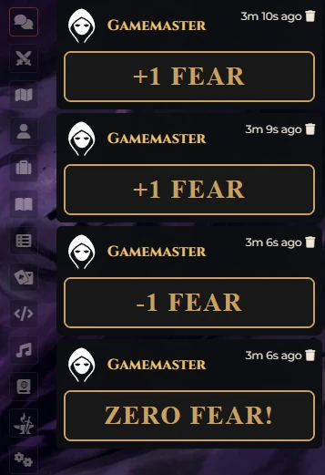

# Daggerheart: Fear Macros

A Foundry VTT module designed for the **Daggerheart** system. The primary goal of this module is to trigger specific macros whenever the global Fear resource changes.

This allows Game Masters to automate events, send chat messages, or trigger visual effects (via macros) exactly when the Fear count goes up, down, hits zero, or reaches the configured maximum.

A simple example of a chat message displayed when Fear changes:
<p align="center">
  
</p>

## ✨ Features

- **Automated Triggers:** Detects changes in the global Daggerheart Fear resource.
- **Dynamic Limits:** Automatically respects the maximum Fear value configured in the system settings (no longer fixed at 12).
- **Configurable Macros:** Assign different macros for:
  - Fear Increase
  - Fear Decrease
  - Fear Max (System Limit)
  - Fear Min (0)

## 🚀 Getting Started

This module includes a **Compendium Pack** named `Daggerheart: Fear Macros` containing basic examples.

1. Go to the **Compendium Packs** tab in Foundry VTT.
2. Locate **Daggerheart: Fear Macros**.
3. Import the macros into your world.
4. The module settings are pre-configured to use these default names.

<p align="center">
  
</p>

## ⚙️ Configuration

Go to the **Module Settings** tab in Foundry VTT to configure the behavior:

| Setting / Trigger | Description |
| :--- | :--- |
| **Macro: Increase Fear** | Runs when Fear goes UP (but has not yet reached the maximum). |
| **Macro: Decrease Fear** | Runs when Fear goes DOWN (but has not yet reached 0). |
| **Macro: Fear Max** | Runs when Fear reaches the **maximum value defined in system settings**. |
| **Macro: Fear Min** | Runs when Fear reaches exactly **0**. |

> **Note:** The module executes triggers ONLY on the GM's client to prevent duplicate effects.

<p align="center">
  
</p>

## 🔧 Manual Installation

To install this module manually, use the following manifest URL in the "Install Module" dialog within Foundry VTT:

```js
https://raw.githubusercontent.com/brunocalado/daggerheart-fear-macros/main/module.json
```

## 📜 Changelog

You can read the full history of changes in the [CHANGELOG](CHANGELOG.md).

## ⚖️ License

Code license at [LICENSE](LICENSE).

This module is an independent project and is not affiliated with the official Daggerheart system creators.
