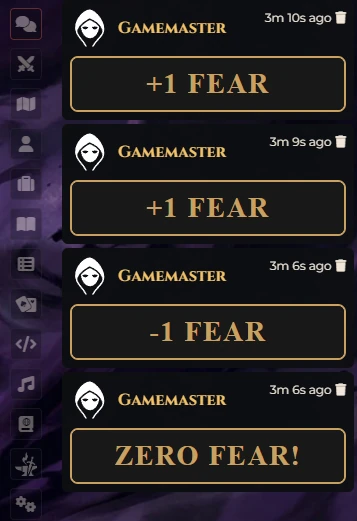
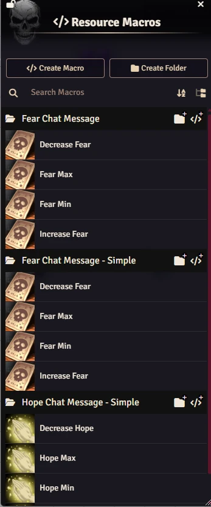
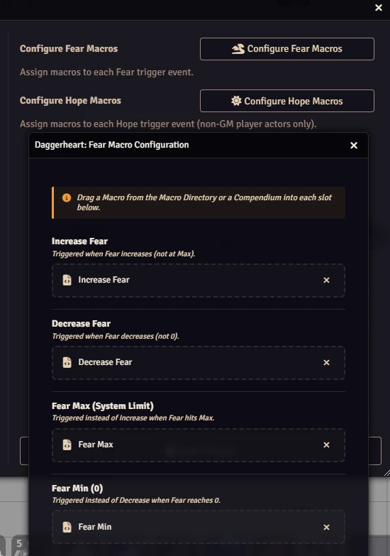

# Daggerheart: Resource Macros

A Foundry VTT module designed for the **Daggerheart** system. It automatically triggers macros whenever the global **Fear** resource or a player character's **Hope** resource changes.

This allows Game Masters to automate events, send chat messages, or trigger visual effects exactly when Fear goes up, Hope runs out, or any other threshold is crossed.

A simple example of a chat message displayed when Fear changes:
<p align="center">
  
</p>

## ✨ Features

- **Fear Triggers:** Detects changes in the global Daggerheart Fear resource.
- **Hope Triggers:** Detects changes in Hope for every player-owned character.
- **Dynamic Limits:** Automatically respects the maximum Fear value configured in the system settings (no longer fixed at 12).
- **Configurable Macros:** Assign different macros for each trigger event (see below).
- **`Resource.Message()` API:** A simple function you can call inside any macro to send a styled Daggerheart chat card, with optional text, background image, and sound.

## 🚀 Getting Started

This module includes a **Compendium Pack** named `Resource Macros` containing basic examples.

1. Go to the **Compendium Packs** tab in Foundry VTT.
2. Locate **Resource Macros**.
3. Import the macros into your world.
4. The module settings are pre-configured to use these default names.

<p align="center">
  
</p>

## ⚙️ Configuration

Go to the **Module Settings** tab in Foundry VTT to configure the behavior.

### Fear Triggers

| Trigger | Description |
| :--- | :--- |
| **Macro: Increase Fear** | Runs when Fear goes UP (but has not yet reached the maximum). |
| **Macro: Decrease Fear** | Runs when Fear goes DOWN (but has not yet reached 0). |
| **Macro: Fear Max** | Runs when Fear reaches the **maximum value defined in system settings**. |
| **Macro: Fear Min** | Runs when Fear reaches exactly **0**. |

### Hope Triggers

| Trigger | Description |
| :--- | :--- |
| **Macro: Increase Hope** | Runs when a player character's Hope goes UP (but has not yet reached the maximum). |
| **Macro: Decrease Hope** | Runs when a player character's Hope goes DOWN (but has not yet reached 0). |
| **Macro: Hope Max** | Runs when Hope reaches the character's maximum value. |
| **Macro: Hope Zero** | Runs when Hope reaches exactly **0**. |

> **Note:** All triggers execute only on the GM's client to prevent duplicate effects. Hope macros receive the `actor` variable in scope, so you can reference the character who triggered the change inside the macro script.

<p align="center">
  
</p>

## 💬 Resource.Message() — Chat Card API

The module exposes a function called `Resource.Message()` that you can use inside any macro to send a styled Daggerheart chat card to all players.

Full documentation is available on the [Wiki](https://github.com/brunocalado/daggerheart-fear-macros/wiki/Resource.Message()-%E2%80%94-Chat-Card-API).

**Header only** — a minimal announcement:
```js
Resource.Message({ header: "-1 Fear" });
```

## 🔧 Manual Installation

To install this module manually, use the following manifest URL in the "Install Module" dialog within Foundry VTT:

```
https://raw.githubusercontent.com/brunocalado/daggerheart-fear-macros/main/module.json
```

## 📜 Changelog

You can read the full history of changes in the [CHANGELOG](CHANGELOG.md).

## ⚖️ License

Code license at [LICENSE](LICENSE).

This module is an independent project and is not affiliated with the official Daggerheart system creators.

# 🧰 My Daggerheart Modules

| Module | Description |
| :--- | :--- |
| 💀 [**Adversary Manager**](https://github.com/brunocalado/daggerheart-advmanager) | Scale adversaries instantly and build balanced encounters in Foundry VTT. |
| 🌟 [**Best Modules**](https://github.com/brunocalado/dh-best-modules) | A curated collection of essential modules to enhance the Daggerheart experience. |
| 🐉 [**Colossus**](https://github.com/brunocalado/dh-colossus) | Manage massive multi-part boss encounters with independent HP per part and a single shared stress pool. |
| 💥 [**Critical**](https://github.com/brunocalado/daggerheart-critical) | Animated Critical. |
| 💠 [**Custom Stat Tracker**](https://github.com/brunocalado/dh-new-stat-tracker) | Add custom trackers to actors. |
| ☠️ [**Death Moves**](https://github.com/brunocalado/daggerheart-death-moves) | Enhances the Death Move moment with a dramatic interface and full automation. |
| 📏 [**Distances**](https://github.com/brunocalado/daggerheart-distances) | Visualizes combat ranges with customizable rings and hover calculations. |
| 📦 [**Extra Content**](https://github.com/brunocalado/daggerheart-extra-content) | Homebrew for Daggerheart. |
| 🤖 [**Resource Macros**](https://github.com/brunocalado/daggerheart-fear-macros) | Automatically executes macros when the Fear or Hope resource changes. |
| 😱 [**Fear Tracker**](https://github.com/brunocalado/daggerheart-fear-tracker) | Adds an animated slider bar with configurable fear tokens to the UI. |
| 🧟 [**Horde**](https://github.com/brunocalado/dh-horde) | Explode single horde tokens into dozens of individual tokens and manage their movement and stats automatically. |
| 🎁 [**Mystery Box**](https://github.com/brunocalado/dh-mystery-box) | Introduces mystery box mechanics for random loot and surprises. |
| ⚡ [**Quick Actions**](https://github.com/brunocalado/daggerheart-quickactions) | Quick access to common mechanics like Falling Damage, Downtime, etc. |
| 📜 [**Quick Rules**](https://github.com/brunocalado/daggerheart-quickrules) | Fast and accessible reference guide for the core rules. |
| 🎲 [**Stats**](https://github.com/brunocalado/daggerheart-stats) | Tracks dice rolls from GM and Players. |
| 🧠 [**Stats Toolbox**](https://github.com/brunocalado/dh-statblock-importer) | Import using a statblock. |
| 🛒 [**Store**](https://github.com/brunocalado/daggerheart-store) | A dynamic, interactive, and fully configurable store for Foundry VTT. |
| 🔍 [**Unidentified**](https://github.com/brunocalado/dh-unidentified) | Obfuscates item names and descriptions until they are identified by the players. |

# 🗺️ Adventures

| Adventure | Description |
| :--- | :--- |
| ✨ [**I Wish**](https://github.com/brunocalado/i-wish-daggerheart-adventure) | A wealthy merchant is cursed; one final expedition may be the only hope. |
| 💣 [**Suicide Squad**](https://github.com/brunocalado/suicide-squad-daggerheart-adventure) | Criminals forced to serve a ruthless master in a land on the brink of war. |
